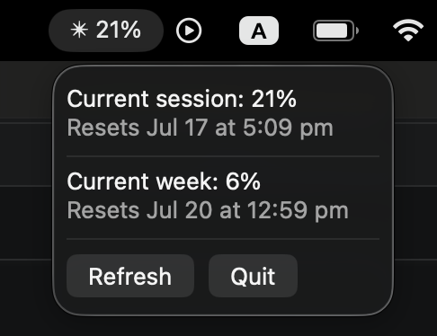

# Claude Usage Menu Bar

This app displays a user's Claude Code session usage on the Mac menu bar, and when the user clicks on it, expands to the current and weekly usage information. I wrote this so I don't keep having to use `/usage`, and as a fun way to get used to Swift.



## Features

- Live session/weekly usage % in the menu bar
- Reset time for session and weekly limits
- Manual refresh + auto-refresh every 5 minutes

## Requirements

- macOS 15+
- Claude CLI installed and authenticated
- Swift 6.3+ (if building from source)

## Installation

```bash
git clone https://github.com/marumakes/claude-usage-menu-bar.git
cd claude-usage-menu-bar
swift build
swift run
```

## Tech Stack

- Swift / SwiftUI
- `MenuBarExtra`
- `Foundation`'s `Process`
- `@Observable`

## What I Learned

As my first Swift/SwiftUI project, I found the readability and type-strictness of Swift made it really easy to start coding. Swift using a cooperative thread pool for asynchronous tasks instead of interleaving on a single thread was interesting, as I've not done a huge amount of thread/concurrency-related coding. I think the biggest challenge I faced was initially not knowing that the Claude CLI doesn't return a uniform output. For example, the time can be returned as `h:mma` or `ha`. This meant I spent a lot of time wrangling with parsing, when I should have just used regex from the start. That being said, this got me quite familiar with strings in Swift.

## Known Limitations / Future Improvements

- Using Claude to find out usage adds a small amount of usage itself
- CLI occasionally returns output without the percentage lines (possibly related to Anthropic's servers) - `refresh()` attempts up to 3 times as a workaround
- CLI path is currently hardcoded to `/opt/homebrew/bin/claude`
- Uncovered edge case for the year (Dec 31 to Jan 1) - this is currently never displayed anyway but is worth keeping in mind
- Currently no tests

## License

MIT
